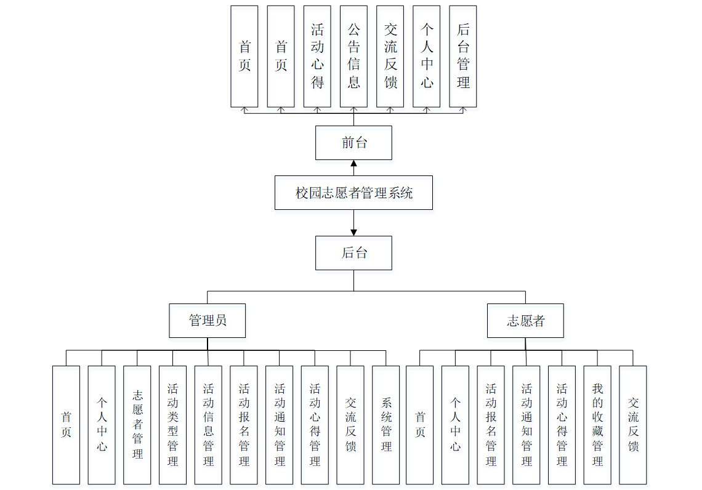
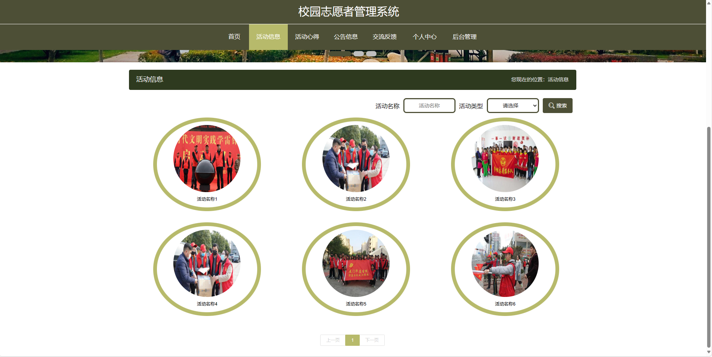
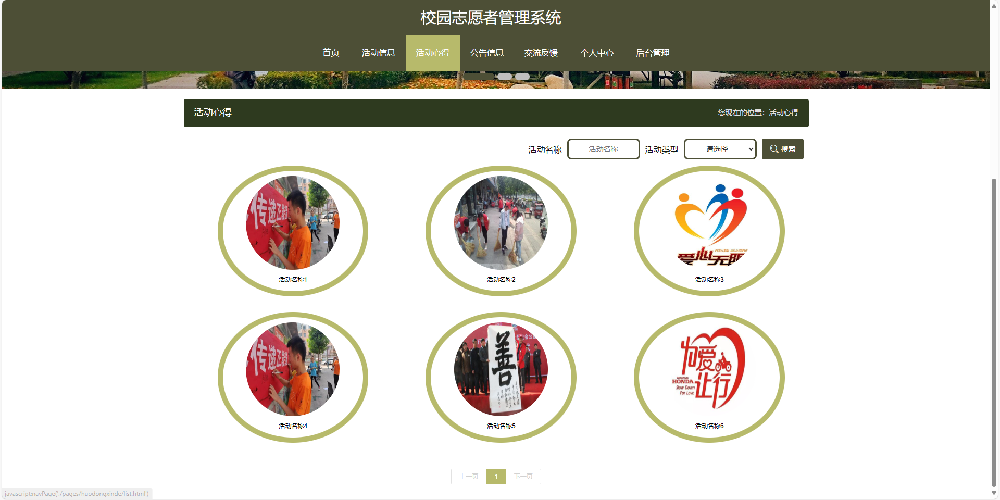
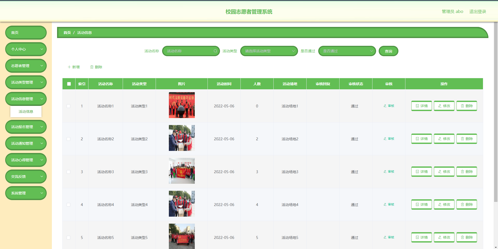
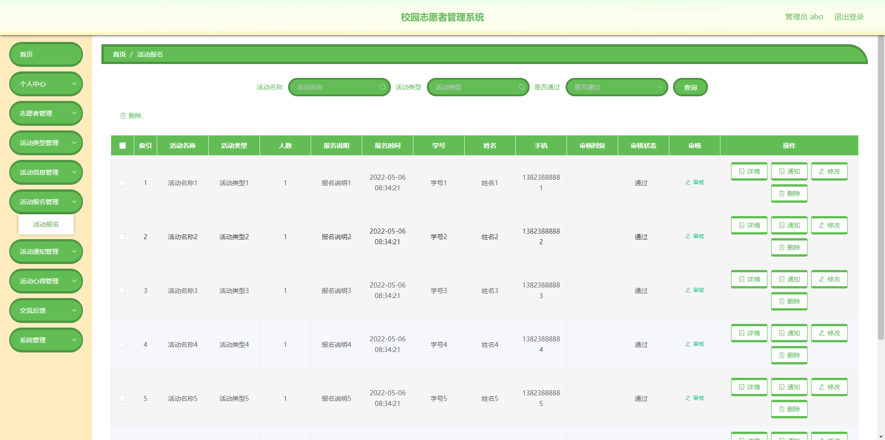
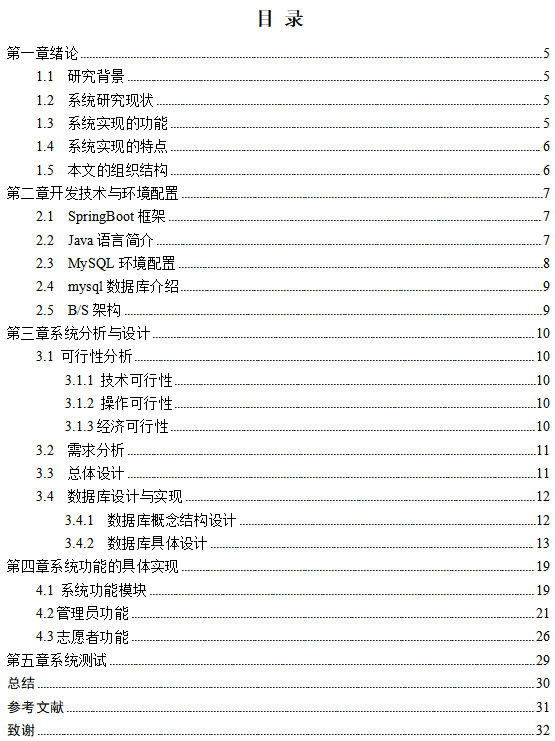
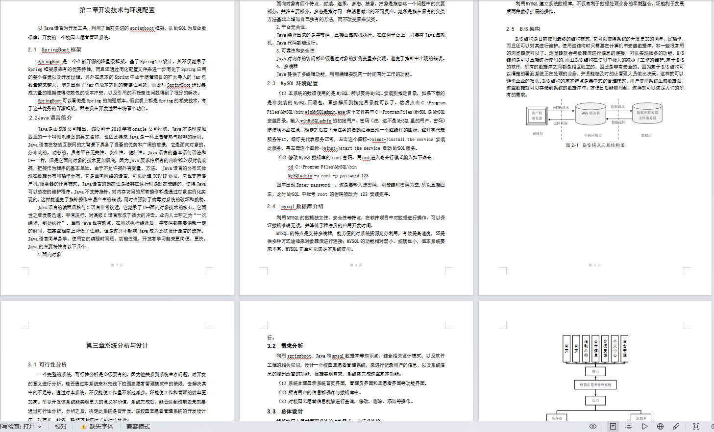

# 美食食谱分享推荐系统

### 9.9￥ 获取完整源码+sql，附赠11000字论文参考，需要的加Q：3808981644 备用Q：3577148218
### 有问题，或者需要协助调试运行项目的也可联系

## 一、介绍

开发语言：java

运行环境:idea或eclipse vscode 数据库:mysql

前端主要采用的技术：vue, element-ui

后端主要采用的技术：springboot , mybatis-plus

### 管理员功能:

登录、首页、个人中心、志愿者管理、活动类型管理、活动信息管理、活动报名管理、活动通知管理、活动心得管理、交流反馈、系统管理

### 用户功能:

登录、注册、首页、活动信息、活动心得、公告信息、交流反馈、个人中心、我的收藏、后台管理、活动报名管理、活动通知管理、活动心得管理、交流反馈

## 二、部分页面截图展示

## 三、10000字论文参考

### 9.9￥ 获取完整源码+sql，附赠11000字论文参考，需要的加Q：3808981644 备用Q：3577148218
### 有问题，或者需要协助调试运行项目的也可联系

